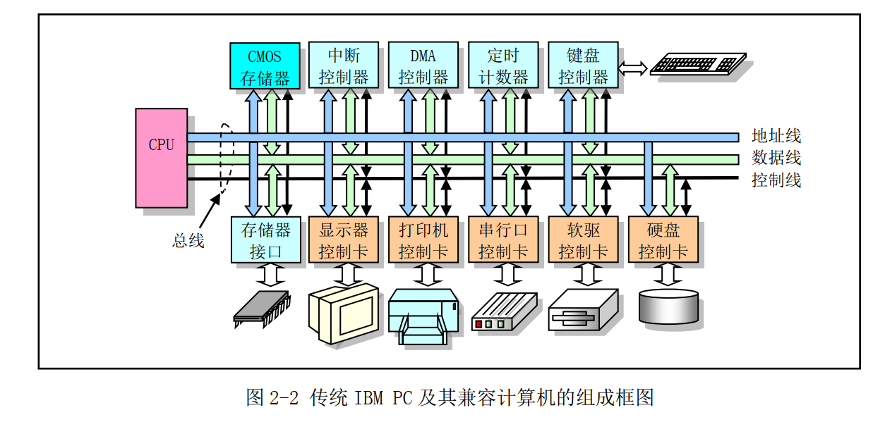
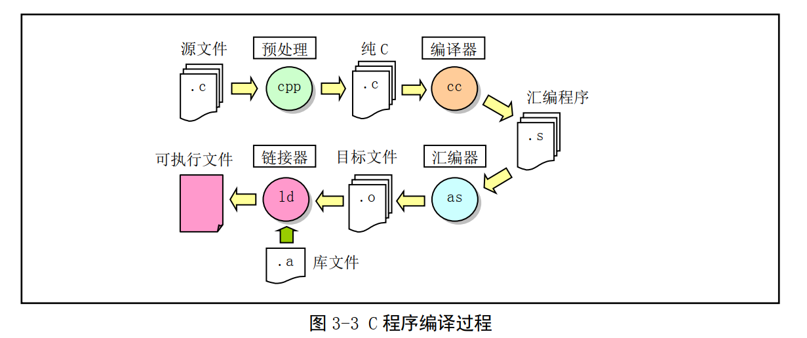
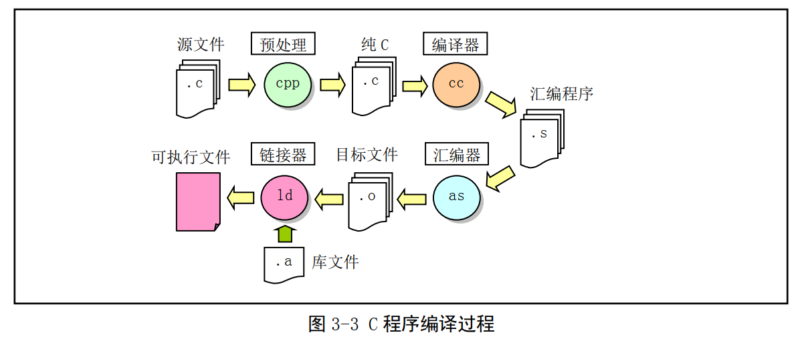

# 概述

## 1.1 Linux 的诞生和发展

Linux 操作系统是 UNIX 操作系统的一种克隆系统。
Linux 操作系统的诞生、发展和成长过程依赖于以下五个重要支柱： UNIX 操作系统、 MINIX 操作系统、 GNU 计划、 POSIX 标准和 Internet 网络。




## 3.1.4as86 和 ld86 使用方法和选项
### as 的使用方法和选项：
as [-03agjuw] [-b [bin]] [-lm [list]] [-n name] [-o objfile] [-s sym] srcfile
默认设置 (除了以下默认值以外，其他选项默认为关闭或无；若没有明确说明 a 标志，则不会有输出):
-3 使用 80386 的 32 位输出；
list 在标准输出上显示；
name 源文件的基本名称（即不包括'.'后的扩展名）；
各选项含义：
-0 使用 16 比特代码段；
-3 使用 32 比特代码段；
-a 开启与 GNU as、 ld 的部分兼容性选项；
-b 产生二进制文件，后面可以跟文件名；
-g 在目标文件中仅存入全局符号；
-j 使所有跳转语句均为长跳转；
-l 产生列表文件，后面可以跟随列表文件名；
-m 在列表中扩展宏定义；
-n 后面跟随模块名称（取代源文件名称放入目标文件中） ；
-o 产生目标文件，后跟目标文件名（ objfile） ；
-s 产生符号文件，后跟符号文件名；
-u 将未定义符号作为输入的未指定段的符号；
-w 不显示警告信息；

### ld 连接器的使用语法和选项：
对于生成 Minix a.out 格式的版本：
ld [-03Mims[-]] [-T textaddr] [-llib_extension] [-o outfile] infile...
对于生成 GNU-Minix 的 a.out 格式的版本：
ld [-03Mimrs[-]] [-T textaddr] [-llib_extension] [-o outfile] infile...
默认设置(除了以下默认值以外，其他选项默认为关闭或无):
-03 32 位输出；
outfile a.out 格式输出；
-0 产生具有 16 比特魔数的头结构，并且对-lx 选项使用 i86 子目录；
-3 产生具有 32 比特魔数的头结构，并且对-lx 选项使用 i386 子目录；
-M 在标准输出设备上显示已链接的符号；
-T 后面跟随正文基地址 (使用适合于 strtoul 的格式)；
-i 分离的指令与数据段（ I&D）输出；
-lx 将库/local/lib/subdir/libx.a 加入链接的文件列表中；
-m 在标准输出设备上显示已链接的模块；
-o 指定输出文件名，后跟输出文件名；
-r 产生适合于进一步重定位的输出；
-s 在目标文件中删除所有符号。


### 3.2.6as汇编命令
3.2.6.1 .align abs-expr1, abs-expr2, abs-expr3
3.2.6.2 .ascii "string"...
3.2.6.3 .asciz "string"...
3.2.6.4 .byte expressions
3.2.6.5 .comm symbol, length
3.2.6.6 .data subsection
3.2.6.7 .desc symbol, abs-expr
3.2.6.8 .fill repeat, size, value
3.2.6.9 .global symbol （或者.globl symbol）
3.2.6.10 .int expressions
3.2.6.11 .lcomm symbol, length
3.2.6.12 .long expressions
3.2.6.13 .octa bignums
3.2.6.14 .org new_lc, fill
3.2.6.15 .quad bignums
3.2.6.16 .short expressions （同.word expressions）
3.2.6.17 .space size, fill
3.2.6.18 .string "string"
3.2.6.19 .text subsection
3.2.6.20 .word expressions

3.2.8 AS 汇编器命令行选项
-a 开启程序列表
-f 快速操作
-o 指定输出的目标文件名
-R 组合数据区和代码区
-W 取消警告信息

使用 gcc 汇编器编译 C 语言程序时通常会经过四个处理阶段，即预处理阶段、编译阶段、汇编阶段和
链接阶段，见图 3-3 所示。


```
gcc [ 选项 ] [ -o outfile ] infile ...

gcc -o hello hello.c // 编译 hello.c 程序，生成执行文件 hello。
gcc -S -o hello.s hello.c // 编译 hello.c 程序，生成对应汇编程序 hello.s。
gcc -c -o hello.o hello.c // 编译 hello.c 程序，生成对应目标文件 hello.o 而不链接。

```
### 3.3.1 C 程序编译和链接


### 3.3.2嵌入汇编
具有输入和输出参数
的嵌入汇编语句的基本格式为：
```
asm(“ 汇编语句”
: 输出寄存器
: 输入寄存器
: 会被修改的寄存器);
```
> 除第 1 行以外，后面带冒号的行若不使用就都可以省略。

这里列出了 kernel/traps.c 文件中第 22 行开始的
一段代码作为例子来详细解说。

```bash
01 #define get_seg_byte(seg,addr) \
02 ({ \
03 register char __res; \                   // 定义了一个寄存器变量__res。
04 __asm__("push %%fs; \                    // 首先保存 fs 寄存器原值（段选择符）。
05          mov %%ax,%%fs; \                // 然后用 seg 设置 fs。
06          movb %%fs:%2,%%al; \            // 取 seg:addr 处 1 字节内容到 al 寄存器中。
07          pop %%fs" \                     // 恢复 fs 寄存器原内容。
08          :"=a" (__res) \                 // 输出寄存器列表。
09          :"0" (seg),"m" (*(addr))); \    // 输入寄存器列表。
10 __res;})
```

## AT&T 格式 和 intel 格式

| 代码 | 说明 | 代码 | 说明 |
| -- | -- | -- | -- |
| a  | 使用寄存器eax| m| 使用内存地址|
| b | 使用寄存器 ebx| o| 使用内存地址并可以加偏移值|
| c | 使用寄存器 ecx| I |使用常数 0-31|
| d | 使用寄存器 edx| J |使用常数 0-63|
| S |  使用 esi |K |使用常数 0-255|
| D | 使用 edi |L |使用常数 0-65535|
| q | 使用动态分配字节可寻址寄存器（ eax、 ebx、 ecx 或 edx）|M |使用常数 0-3|
| r |使用任意动态分配的寄存器 |N| 使用 1 字节常数（ 0-255）|
| g| 使用通用有效的地址即可（ eax、 ebx、 ecx、 edx 或内存变量）|O |使用常数 0-31|
| A |使用 eax 与 edx 联合(64 位) |=| 输出操作数。输出值将替换前值 |
| +| 表示操作数可读可写 | & | 早期会变的（ earlyclobber）操作数。表示在使用完操作数之前，内容会被修改 |

---
下面再例举一个较长的例子，如果能看得懂，那就说明嵌入汇编代码对你来说基本没问题了。这段代
码是从 include/string.h 文件中摘取的，是 strncmp()字符串比较函数的一种实现。同样，其中每行中的"\n\t"
是用于 gcc 预处理程序输出列表好看而设置的。
---

```bash
//// 字符串 1 与字符串 2 的前 count 个字符进行比较。
// 参数： cs - 字符串 1， ct - 字符串 2， count - 比较的字符数。
// %0 - eax(__res)返回值， %1 - edi(cs)串 1 指针， %2 - esi(ct)串 2 指针， %3 - ecx(count)。
// 返回：如果串 1 > 串 2，则返回 1；串 1 = 串 2，则返回 0；串 1 < 串 2，则返回-1。

extern inline int strncmp(const char * cs,const char * ct,int count)
{
register int __res ;                // __res 是寄存器变量。
__asm__("cld\n"                     // 清方向位。
        "1:\tdecl %3\n\t"           // count--。
        "js 2f\n\t"                 // 如果 count<0，则向前跳转到标号 2。
        "lodsb\n\t"                 // 取串 2 的字符 ds:[esi]al，并且 esi++。
        "scasb\n\t"                 // 比较 al 与串 1 的字符 es:[edi]，并且 edi++。
        "jne 3f\n\t"                // 如果不相等，则向前跳转到标号 3。
        "testb %%al,%%al\n\t"       // 该字符是 NULL 字符吗？
        "jne 1b\n"                  // 不是，则向后跳转到标号 1，继续比较。
        "2:\txorl %%eax,%%eax\n\t"  // 是 NULL 字符，则 eax 清零（返回值）。
        "jmp 4f\n"                  // 向前跳转到标号 4，结束。
        "3:\tmovl $1,%%eax\n\t"     // eax 中置 1。
        "jl 4f\n\t"                 // 如果前面比较中串 2 字符<串 1 字符， 则返回 1，结束。
        "negl %%eax\n"              // 否则 eax = -eax，返回负值，结束。
        "4:"
        :"=a" (__res):"D" (cs),"S" (ct),"c" (count):"si","di","cx");
return __res;                       // 返回比较结果。
}
1
```
> 说实话这段代码我没看懂，后面看看
> \tdecl %3\n\t 这些斜杠代表什么呢？ 看的太快？ 没看到含义？

